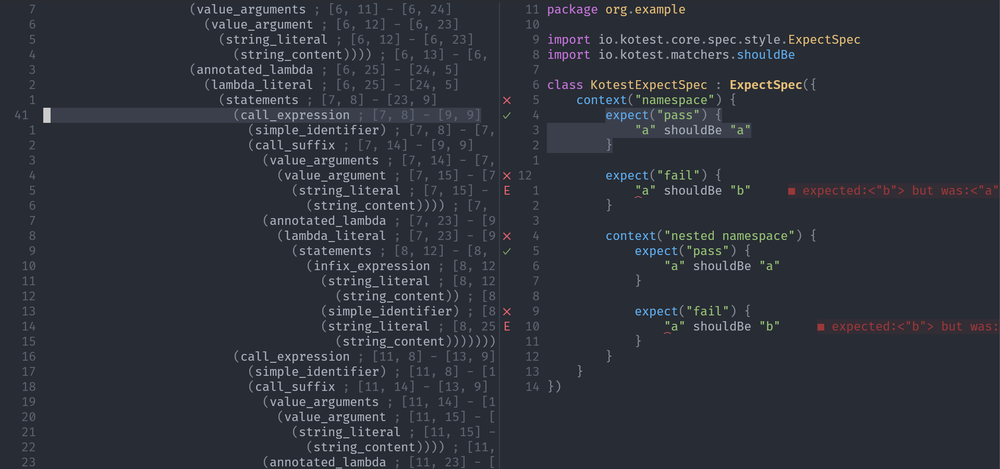

# Contributing

PRs and issues are always welcome, if you have any questions or need help, feel free to open a new discussion on this project.

## Common Commands

### Running Tests

This will create a `.tests` directory that contains all the plugin dependencies of neotest-kotlin.

```shell
make test
```

### Running formatter

This requires that [StyLua](https://github.com/JohnnyMorganz/StyLua) is installed.

```shell
make format
```

## Modifying/Adding Test Detection

In the [treesitter module](../lua/neotest-kotlin/treesitter) there are queries for deteching

- Java package
- Java class name
- Test formats

For adding new tests

1. Create a new test in [example_project](../tests/example_project/) for your format
2. use `:InspectTree` to view the current Treesitter output



3. Copy that query
4. Use `:EditQuery` to test the query

```scm
(call_expression
  (simple_identifier) @function_name (#eq? @function_name "expect")
    (call_suffix
      (value_arguments
        (value_argument
          (string_literal
            (string_content) @test.name
          )
        )
      ) (annotated_lambda)
    )
) @test.definition
```


5. Ensure proper Neotest conformation

| capture node          | description                                     | example |
| --------------------- | ----------------------------------------------- | ------- |
| @test.name            | the name of the test (without quotes)           | expect  |
| @test.definition      | the entirety of the test                        |         |
| @namespace.name       | the name of the test namespace (without quotes) | context |
| @namespace.definition | the entirety of the test namespace              |         |

6. Update/Add tests in [treesitter tests](../tests/treesitter/treesitter_spec.lua)
